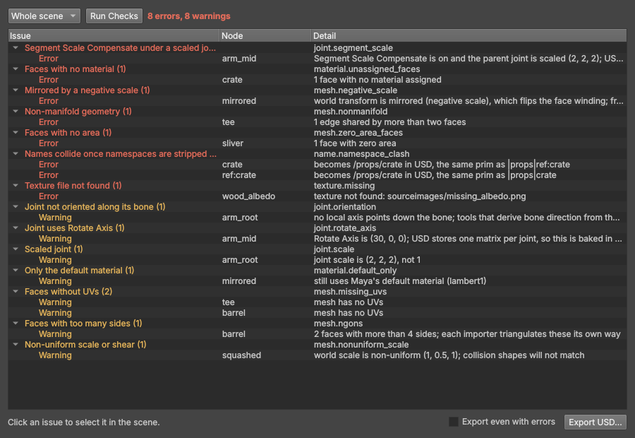
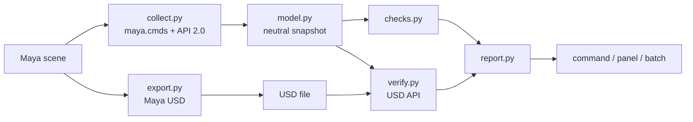

# maya-usd-preflight

A Maya plug-in that checks a scene before it is exported to USD, then checks the export.

Most of what goes wrong with a USD asset downstream is already wrong in the
Maya scene: a face with no material, a texture path that only exists on one
machine, a mirrored transform, a joint set up in a way no other tool stores.
The exporter writes the file anyway. `usdPreflight` finds those problems while
they are still one click from being fixed, and after the export it opens the
file and makes sure it matches the scene.



*The panel, drawn outside Maya from the results for `examples/make_scenes.py`'s broken scene.*

## What it checks

| Check | Default | What it finds |
| --- | --- | --- |
| `scene.empty` | error | No meshes or joints to export |
| `scene.up_axis`, `scene.units` | error | Scene up axis or linear unit differs from the profile (off unless the profile sets them) |
| `mesh.empty` | error | A mesh with no faces |
| `mesh.nonmanifold` | error | Edges shared by more than two faces, vertices joining faces that share no edge |
| `mesh.lamina_faces` | error | Faces stacked on each other, sharing all their edges |
| `mesh.zero_area_faces` | error | Faces collapsed to a line or a point |
| `mesh.ngons` | warning | Faces with more than four sides (each importer triangulates them its own way) |
| `mesh.missing_uvs` | warning | Faces, or whole meshes, without UVs |
| `mesh.negative_scale` | error | A mirrored world transform, which flips face winding |
| `mesh.nonuniform_scale` | warning | Non-uniform world scale, or shear |
| `material.unassigned_faces` | error | Faces with no material |
| `material.default_only` | warning | A mesh still on `lambert1` |
| `texture.missing` | error | A file node whose texture is not on disk (UDIM tiles included) |
| `texture.outside_project` | warning | An absolute texture path outside the Maya project |
| `name.namespace_clash` | error | Two nodes that become the same prim once namespaces are stripped |
| `joint.rotate_axis` | warning | A joint using Rotate Axis, which USD bakes into one matrix |
| `joint.segment_scale` | error | Segment Scale Compensate under a scaled joint; USD has no equivalent |
| `joint.scale` | warning | A joint whose scale is not 1 |
| `joint.orientation` | warning | A joint with no axis along its bone, or an aim axis unlike the rest of the skeleton |

Every issue names the node and, where it applies, the exact faces, edges or
vertices, so the panel can select them.

## After the export

With an export path, the plug-in exports through Maya USD and then opens the
file with the USD API and compares it with the scene it just checked:

| Check | Compares |
| --- | --- |
| `export.bounds` | World-space bounds of the visible meshes, in metres, on both sides |
| `export.up_axis` | The stage's `upAxis` with Maya's |
| `export.mesh_count` | Mesh prims with Maya meshes, counting each instance |
| `export.materials` | Meshes with a material in Maya that have a binding in the stage |
| `export.default_prim` | That the stage can be referenced without naming a prim |

A wrong unit scale, a dropped transform or a missing mesh moves the bounds, so
the export fails loudly instead of failing later in someone else's tool.

## Install

Point Maya at this folder, then load the plug-in from the Plug-in Manager or
from script.

Windows:

```bat
set MAYA_MODULE_PATH=C:\path\to\maya-usd-preflight
```

macOS / Linux:

```bash
export MAYA_MODULE_PATH=/path/to/maya-usd-preflight
```

```python
from maya import cmds
cmds.loadPlugin("usdPreflight.py")
```

`usdPreflight.mod` tells Maya where the plug-in and its Python package are, so
nothing is copied into your Maya preferences.

## Use

**The panel.** *USD Preflight > Open Panel*. Run the checks on the whole scene
or the selection, click an issue to select what is wrong, export when it is
clean. Export stays disabled while there are errors unless you tick *Export
even with errors*.

**The command.** Returns the report as JSON and prints it to the Script Editor.

```python
import json
from maya import cmds

report = json.loads(cmds.usdPreflight())
cmds.usdPreflight(selection=True, export="C:/show/crate.usda", report="C:/show/crate.report.json")
```

```mel
usdPreflight -selection -profile "profiles/sim_ready.json";
```

| Flag | Meaning |
| --- | --- |
| `-sl` / `-selection` | Check what is under the selection, not the whole scene |
| `-p` / `-profile PATH` | JSON profile: thresholds, disabled checks, severities |
| `-ex` / `-export PATH` | Export to USD if no check fails, then check the file |
| `-f` / `-force` | Export even if a check fails |
| `-r` / `-report PATH` | Also write the report to a JSON file |

**Batch.** No interface, one report per scene, exit code 1 if any scene has errors.

```console
mayapy preflight_batch.py scenes/ --out out/ --export --snapshots
```

`--snapshots` saves what was read from each scene. A snapshot can be checked
again later with plain Python, for example against a stricter profile, without
opening Maya:

```console
python -m usd_preflight out/crate.snapshot.json --profile profiles/sim_ready.json
```

## Profiles

A profile is a JSON file. Unknown settings and misspelt check names are
rejected instead of being ignored.

```json
{
  "up_axis": "z",
  "linear_unit": "cm",
  "max_face_sides": 4,
  "severity": { "mesh.ngons": "error", "mesh.missing_uvs": "error" },
  "disable": ["material.default_only"]
}
```

## How it works



- **`plug-ins/usdPreflight.py`** is the plug-in: an `MPxCommand` with its flag
  syntax, and the menu.
- **`collect.py`** is the only file that asks Maya about geometry, shading and
  joints. Mesh data comes from API 2.0 iterators and `MFnMesh`.
- **`model.py`** is a small snapshot of the scene that imports nothing from
  Maya. Everything after this point works on the snapshot.
- **`checks.py`** holds the checks, one small function each. Adding a check
  means writing a function and decorating it.
- **`verify.py`** compares an exported stage with the snapshot.
- **`ui.py`** is a Qt panel that only talks to three callbacks, so it can be
  built and tested without Maya.

## Tests

```bash
python -m venv .venv
source .venv/bin/activate        # Windows: .venv\Scripts\activate
python -m pip install -e ".[dev]"
python -m pytest -q
```

Outside Maya, the checks run on hand-built snapshots, the export comparison
runs on stages authored with `usd-core` (a faithful one, then ones with a unit
mistake, a lost transform, a missing mesh, a lost material), and the panel is
driven headlessly.

Inside Maya:

```bash
mayapy -m pip install pytest
mayapy -m pytest tests/maya -v
```

`examples/make_scenes.py` builds a clean scene and a broken one with one known
problem per object. The Maya tests check that reading the broken scene reports
exactly those problems, on those nodes, and that the clean scene reports none,
exports, and matches its file. CI runs them in Maya 2024 and 2025 containers.

## Status and limits

- The Maya side has not been run yet. The code that reads the scene, the
  command and the export are written against the Maya documentation and are
  waiting on their first CI run inside Maya.
- The panel has only been run outside Maya, on callbacks.
- Only polygon meshes and joints are read. NURBS, curves, cameras, lights and
  animation are not checked.
- Skinned meshes are exported in their bind pose, so for a posed character a
  bounds mismatch is reported as a warning, not an error.
- The joint checks look at how joints are set up in Maya. They do not prove a
  skeleton will look right in another tool.
- Mesh reading loops over faces in Python, so very heavy meshes will be slow.

## Next steps

- [ ] Fix buttons for the mechanical problems (assign a material, freeze scale)
- [ ] Check that file textures have a colour space the exporter understands
- [ ] Skin weights: influences per vertex, unnormalised weights
- [ ] A C++ version of the mesh pass for heavy scenes
